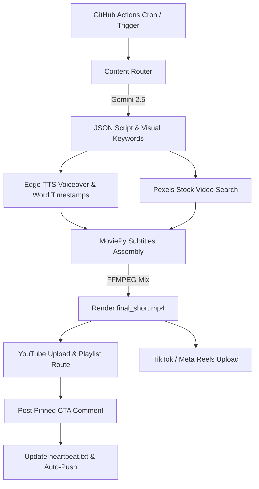

# 🎬 Automated YouTube Shorts & Reels Generator

An enterprise-grade, fully automated pipeline that generates and publishes highly engaging vertical video shorts (YouTube Shorts, Instagram Reels, TikTok, and Facebook Reels) on a daily schedule using Python, GitHub Actions, Gemini, Edge-TTS, Pexels, and MoviePy.

---

## ✨ Features

*   **🚦 Multi-Category Content Router:** Intelligently selects and generates content across distinct categories (Space Mysteries, History Facts, Tech Facts).
*   **🧠 Structured Content Generation:** Uses **Gemini 2.5 Pro** to return structured JSON script content with built-in factual limits, pacing syntax, and dynamic visual keywords.
*   **🗣️ Human-like Voice & Subtitles:** Synthesizes voiceovers with **Edge-TTS** (`en-GB-RyanNeural`) and extracts precise word-level boundaries to overlay hyper-kinetic subtitles.
*   **🎬 Automated Visual Sourcing:** Searches and downloads portrait stock videos from **Pexels** matching LLM-generated keywords, applying dynamic **Ken Burns slow-zoom** motion.
*   **🎵 Resilient Audio Mixing:** Mixes voices and background music using a native **FFMPEG subprocess** to prevent mono/stereo composite layout failures.
*   **📲 Multi-Platform Publishing:** Automated headless publishing to **YouTube Shorts** (with automatic playlist routing and pinned CTA comments), **TikTok**, **Facebook Reels**, and **Instagram Reels**.
*   **🛡️ Content Compliance:** Self-declares the **Synthetic Media** tag on YouTube to fully align with platform guidelines.
*   **💓 60-Day Self-Healing Heartbeat:** Implements Git-level persistence and auto-commits to keep the GitHub Actions cron running indefinitely.

---

## 🛠️ Architecture



---

## 🚀 Setup & Installation

### 1. Local Installation
Clone the repository and install the dependencies:
```bash
git clone https://github.com/thienphucnt/MPVSAP.git
cd MPVSAP
pip install -r requirements.txt
```

### 2. Environment Variables & Secrets
Ensure the following keys are set up in your local shell or as **GitHub Actions Secrets**:

| Secret Key | Description |
| :--- | :--- |
| `GEMINI_API_KEY` | Google AI Studio Gemini API Key |
| `PEXELS_API_KEY` | Pexels Video Search API Authorization Token |
| `YOUTUBE_CLIENT_ID` | OAuth2 Client ID from Google Cloud Console |
| `YOUTUBE_CLIENT_SECRET` | OAuth2 Client Secret from Google Cloud Console |
| `YOUTUBE_REFRESH_TOKEN` | OAuth2 Refresh Token (must include YouTube write scopes) |
| `YT_PLAYLIST_SPACE` | Target Playlist ID for Space Shorts |
| `YT_PLAYLIST_HISTORY` | Target Playlist ID for History Shorts |
| `YT_PLAYLIST_TECH` | Target Playlist ID for Tech Shorts |

---

## ⚙️ CI/CD Runner Configuration

The pipeline runs automatically once daily at **14:00 UTC** via GitHub Actions:

```yaml
on:
  schedule:
    - cron: '0 14 * * *'
  workflow_dispatch:
```

It executes on `ubuntu-latest`, automatically handles `ffmpeg` installation, patches ImageMagick security XML limits, and runs `main.py` using cached python dependencies.
