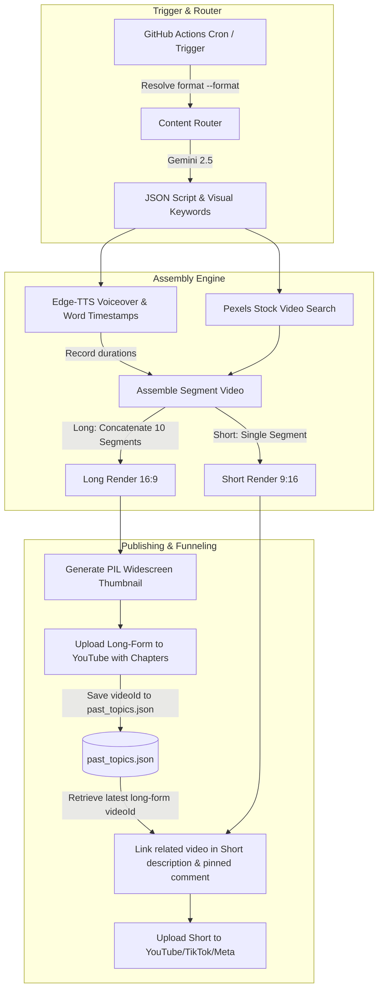

# 🎬 Automated Hybrid Video Generator & Uploader (Shorts + Widescreen Long-Form)

An enterprise-grade, fully automated video generation and publishing pipeline. It automatically generates and publishes both vertical video shorts (YouTube Shorts, Instagram Reels, TikTok, Facebook Reels) 6x daily and widescreen long-form compilations (16:9, 8+ minutes) weekly using Python, Pillow, GitHub Actions, Gemini, Edge-TTS, Pexels, and MoviePy.

---

## ✨ Features

*   **🚦 Multi-Category Content Router:** Intelligently selects and generates content across distinct niches (Scary Space Mysteries, Morbid/Silly History, Future Tech & AI).
*   **📐 Hybrid Aspect Ratios:** 
    *   **Short-Form (9:16):** Renders at `1080x1920` with subtitles positioned at `Y=1350` to avoid player overlays.
    *   **Widescreen Long-Form (16:9):** Renders at `1920x1080` by stitching exactly **10 distinct facts** (speaking time ~8.3 minutes) to cross the YouTube mid-roll ad monetization threshold.
*   **🎨 PIL Widescreen Custom Thumbnails:** Automatically creates thematic widescreen (1280x720) custom thumbnails using PIL. Downloads a relevant Pexels backdrop, applies Gaussian blur, overlay vignetting, draws bold drop-shadow text with key concepts highlighted in yellow, and overlays a niche-themed badge.
*   **📈 Shorts-to-Long Funnel Workaround:** The uploader saves the `videoId` of completed long-form compilations. Daily Shorts automatically scan the history database and prepend a prominent watch link (`🎥 Watch full documentary: https://youtu.be/VIDEO_ID`) to the first line of the Short's description and its pinned comment.
*   **📝 Dynamic MM:SS Chapters:** Spoken TTS durations are dynamically measured during long-form segment assembly. The orchestrator computes exact timeline offsets for each fact and appends a clean `Chapters:` block to the YouTube description.
*   **🗣️ Human-like Voice & Subtitles:** Synthesizes voiceovers with **Edge-TTS** (`en-US-AndrewNeural`) and extracts precise word-level boundaries to overlay hyper-kinetic subtitles.
*   **🎬 Automated Visual Sourcing:** Searches and downloads stock videos from **Pexels** matching LLM-generated keywords, applying dynamic **Ken Burns slow-zoom** motion.
*   **🎵 Resilient Audio Mixing:** Mixes voices and background music using a native **FFMPEG subprocess** to prevent mono/stereo composite layout failures.
*   **💓 Self-Healing Heartbeat:** Implements Git-level persistence and auto-commits to keep the GitHub Actions schedule running indefinitely.

---

## 🛠️ Architecture



---

## 🚀 Setup & Installation

### 1. Local Installation
Clone the repository and install the dependencies:
```bash
git clone https://github.com/thienphucnt/MPVSAP.git
cd MPVSAP
pip install -r requirements.txt
```

### 2. CLI Options
You can run the generator manually with custom options:
```bash
# Generate and upload a standard Short
python main.py

# Generate and compile an 8+ minute widescreen documentary about history
python main.py --format long --category history

# Perform content generation and TTS speech synthesis dry-run without rendering
python main.py --format long --dry-run
```

### 3. Environment Variables & Secrets
Ensure the following keys are set up in your local shell or as **GitHub Actions Secrets**:

| Secret Key | Description |
| :--- | :--- |
| `GEMINI_API_KEY` | Google AI Studio Gemini API Key |
| `PEXELS_API_KEY` | Pexels Video Search API Authorization Token |
| `YOUTUBE_CLIENT_ID` | OAuth2 Client ID from Google Cloud Console |
| `YOUTUBE_CLIENT_SECRET` | OAuth2 Client Secret from Google Cloud Console |
| `YOUTUBE_REFRESH_TOKEN` | OAuth2 Refresh Token (must include YouTube write scopes) |
| `YT_PLAYLIST_SPACE` | Target Playlist ID for Space content |
| `YT_PLAYLIST_HISTORY` | Target Playlist ID for History content |
| `YT_PLAYLIST_TECH` | Target Playlist ID for Tech content |

---

## ⚙️ CI/CD Schedules

The pipeline uses two separate workflows to isolate resources:
1. **Daily Shorts Workflow (`main.yml`):** Runs 6x daily (`cron: '0 */4 * * *'`) with a 30-minute timeout.
2. **Weekly Long-Form Workflow (`long_form.yml`):** Runs once a week on Sundays at 00:00 UTC with a 60-minute timeout for heavy compiling.
