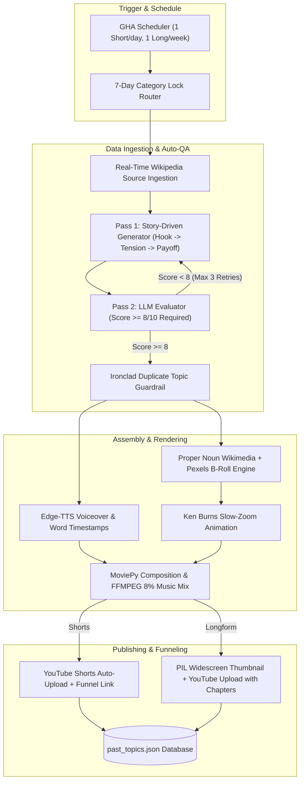

# 🎬 MPVSAP — Automated High-Retention Hybrid Video Engine & Uploader

[](https://github.com/thienphucnt/MPVSAP/actions/workflows/main.yml)
[](https://github.com/thienphucnt/MPVSAP/actions/workflows/long_form.yml)
[](SECURITY.md)

An enterprise-grade, fully automated video generation and publishing pipeline. Built with Python, GitHub Actions, Gemini 2.5 Pro, Edge-TTS, Wikimedia Commons, Pexels API, and MoviePy, MPVSAP automatically produces high-retention vertical Shorts and 8+ minute widescreen documentaries.

---

## ✨ Features & Architecture Highlights

### 🧠 High-Retention Two-Pass Generation Engine (LLM-as-a-Judge)
* **Real-Time Wikipedia Source Text Ingestion**: Automatically fetches rich, un-biased article extracts from Wikipedia REST APIs for Space, History, and Tech. Facts are grounded in real encyclopedia data rather than generic LLM training data.
* **Pass 1 (Story-Driven Generator)**: Formats script narrative using an algorithmic retention structure (**Hook (0-3s) → Conflict/Tension (3-45s) → Payoff & Loop CTA**). Listicles and "Top 3" formats are strictly banned.
* **Pass 2 (Evaluator / Auto-QA Scoring)**: Evaluates generated scripts out of 10 on Hook Strength, Narrative Arc, Absence of AI Clichés, and Fact Grounding. Scripts scoring **< 8/10** trigger automatic rewrite loops.

### 📅 Thematic Block Scheduling & 7-Day Category Lock
* **Automated Rotation**: Locks video output into a single category for 7 consecutive days before rotating to the next:
  * **Week 1 (Days 1–7)**: `Space` (Cosmology, Dark Nebula, Astrophysical Mysteries)
  * **Week 2 (Days 8–14)**: `History` (Bizarre Historical Events, Ancient Artifacts, Unsolved Riddles)
  * **Week 3 (Days 15–21)**: `Tech` (Computing Breakthroughs, AI Revolution, Emerging Science)
* **Execution Cadence**: 1 Short per day (12:00 UTC) & 1 Longform compilation weekly on Sundays (00:00 UTC).

### 🛡️ Ironclad Zero-Duplicate Topic Guardrail (`is_duplicate_topic`)
* **Full History Retention**: Preserves a permanent, uncapped database of every topic and title ever posted ([past_topics.json](past_topics.json)).
* **Multi-Pass Python Validator**: Validates generated content using normalized substring matching, key entity/phrase overlap (e.g. blocking repeated subjects like *"Great Attractor"*, *"False Vacuum"*, *"Cadaver Synod"*, *"Exploding Pants"*), and token Jaccard similarity (> 0.35 threshold).
* **Self-Correction Retry Loop**: Rejects duplicates automatically before video rendering begins.

### 🖼️ Proper Noun Wikimedia B-Roll & Ken Burns Animation Engine
* **Entity Detection**: Instructs Gemini to output proper nouns for specific historical figures, animals, landmarks, or space missions (e.g., `'Albert Einstein'`, `'Apollo 11'`, `'Andromeda Galaxy'`).
* **Wikimedia Commons Integration**: Queries the Wikimedia Action API (`srnamespace=6`) for authentic historical or educational media.
* **Ken Burns Motion**: Converts static Wikimedia images into dynamic portrait/widescreen video clips with smooth zoom-in motion (1.0x to 1.10x zoom over duration).
* **Pexels Fallback**: Seamlessly falls back to Pexels stock video search for generic lowercase keywords.

### 🎵 Curated DMCA-Free Music Library & Audio Balance
* **17 Handpicked Tracks**: Contains thematic, royalty-free Creative Commons (CC-BY) tracks by Kevin MacLeod categorized under `music/space/`, `music/history/`, and `music/tech/`.
* **Precision Audio Balance**: Background music is mixed at a subtle **8% volume multiplier** via FFMPEG subprocesses, ensuring narrations are crystal-clear and never overwhelmed.

### 🗣️ Kinetic Phrase Karaoke Subtitles & Funneling
* **Phrase-Level Subtitles**: Groups Edge-TTS word boundaries into natural 3-to-5 word phrases positioned at `Y=1350` to avoid player UI overlays.
* **Flicker-Free Active Highlight**: Highlights each spoken word in bold yellow (`{\1c&H0000FFFF}`) in real time over standard white dialogue.
* **Shorts-to-Long Funneling**: Daily Shorts automatically inspect channel history and append direct documentary links (`🎥 Watch full documentary: https://youtu.be/VIDEO_ID`) to descriptions.

---

## 📐 Hybrid Format Specifications

| Feature | YouTube Shorts (9:16) | Widescreen Long-Form (16:9) |
| :--- | :--- | :--- |
| **Resolution** | `1080x1920` (Vertical) | `1920x1080` (Widescreen) |
| **Duration** | 60 seconds (~130 words) | 8+ minutes (10 compiled facts) |
| **Pacing** | Fast-paced, seamless loop CTA | Chaptered documentary |
| **Thumbnail** | Auto-extracted | PIL Widescreen Custom Thumbnail (1280x720) |
| **Publish Schedule** | Daily at 12:00 UTC | Sundays at 00:00 UTC |

---

## 🛠️ System Architecture



---

## 🚀 Setup & Usage

### 1. Installation
Clone the repository and install the dependencies:
```bash
git clone https://github.com/thienphucnt/MPVSAP.git
cd MPVSAP
pip install -r requirements.txt
```

### 2. Manual CLI Execution
Run the pipeline locally with custom arguments:
```bash
# Generate and upload daily Short for current 7-day locked category
python main.py

# Force specific category override
python main.py --category history

# Generate widescreen long-form documentary
python main.py --format long --category space

# Dry-run mode (tests ingestion, script generation, and Auto-QA without rendering)
python main.py --dry-run
```

### 3. Required Environment Variables & Secrets

Configure these in your local environment or **GitHub Repository Secrets**:

| Secret Key | Description |
| :--- | :--- |
| `GEMINI_API_KEY` | Google AI Studio API Key (Gemini 2.5 Pro) |
| `PEXELS_API_KEY` | Pexels Video Search Authorization Token |
| `YOUTUBE_CLIENT_ID` | OAuth2 Client ID from Google Cloud Console |
| `YOUTUBE_CLIENT_SECRET` | OAuth2 Client Secret from Google Cloud Console |
| `YOUTUBE_REFRESH_TOKEN` | OAuth2 Refresh Token (with YouTube upload scopes) |
| `YT_PLAYLIST_SPACE` | YouTube Playlist ID for Space content |
| `YT_PLAYLIST_HISTORY` | YouTube Playlist ID for History content |
| `YT_PLAYLIST_TECH` | YouTube Playlist ID for Tech content |

---

## 🔒 Security & Guardrails

- **GHA Bot Authorization**: Issue bot execution (`.github/workflows/antigravity_bot.yml`) is restricted to repository owners (`author_association == 'OWNER'`), preventing external users from exploiting secrets or triggering workflows.
- **Sanitized Search Queries**: Keywords passed to external APIs are cleaned to strip special characters.
- **Credential Isolation**: All tokens and keys are excluded via [.gitignore](.gitignore) and managed through encrypted GHA Secrets. For security details, see [SECURITY.md](SECURITY.md).

---

## 📜 License
Distributed under the MIT License. See `LICENSE` for details.
