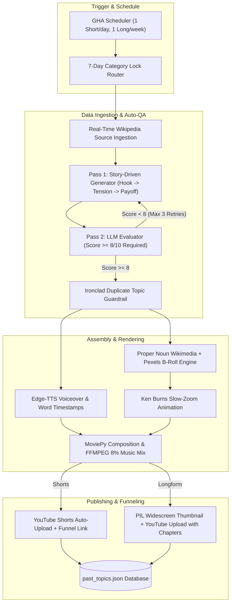

# 🎬 MPVSAP — Multi-Platform Autonomous Video Automation & Telemetry Platform

[](https://github.com/thienphucnt/MPVSAP/actions/workflows/main.yml)
[](https://github.com/thienphucnt/MPVSAP/actions/workflows/self_healing.yml)
[](SECURITY.md)

An enterprise-grade, fully automated AI video production, rendering, multi-platform social publishing, and real-time telemetry analytics platform. Built with Python, GitHub Actions, Next.js 14, Gemini 2.5 Flash, Kokoro TTS, Pexels API, Wikimedia Commons, and MoviePy.

---

## ✨ Features & Architecture Highlights

### 🏆 1. 5-Variant Auto-QA Tournament Engine
* **Real-Time Wikipedia Source Knowledge Ingestion**: Automatically fetches rich article extracts from Wikipedia REST APIs for Space, History, and Tech in **<0.2 seconds**.
* **5-Variant Parallel Generation**: Generates **5 distinct candidate video scripts** per topic across diverse narrative angles (Suspenseful Mystery, Scientific Breakthrough, Dramatic Conflict, Existential Wonder, Action Mystery).
* **Auto-QA Tournament Evaluator**: Automatically scores all 5 candidate variants out of 10 for audience retention loops, hook strength, and topic accuracy, selecting the top-scoring script for production.

### 📊 2. Real-Time Telemetry Control Center (`dashboard/`)
* **Categorized Workflow Tabs**: Filter telemetry across `DAILY SHORTS`, `WEEKLY LONGFORM`, `AI SELF-HEALING`, `BOT MAINTENANCE`, and `ALL PIPELINES`.
* **Pipeline Health Heatmap**: Color-coded execution tracking (`SUCCESS`, `FAILED`, `CANCELLED`, `SKIPPED`) with an **Interactive Checkbox Status Filter Bar**.
* **Dedicated Workflow Inspector Sections**:
  * **Video Upload Inspector**: Winning Script, YouTube Views/Likes/Comments, Source Knowledge, Background Audio Track, Neural Voice Actor, and 5-Variant Auto-QA Tournament Breakdown.
  * **AI Self-Healing Inspector**: Target Pipeline Log, Diagnostic Model Engine, Heal Attempt Counter, Repository Action, and Expandable Log Trace.
  * **Bot Maintenance Inspector**: Repository State, Dependency Cache Status, and Heartbeat Signals.
* **Automated YouTube Deletion Auto-Sync**: Automatically verifies recorded video links against YouTube Data API v3 and marks deleted videos as `FAILED`.

### 🩺 3. AI Self-Healing & Diagnostics (`self_healing.yml` & `self_heal.py`)
* Automatically triggers upon any video pipeline failure.
* Parses failed GitHub Actions log output using Gemini AI.
* Diagnoses root causes, applies automated code patches, increments a strict 3-attempt safety guard, and re-triggers execution.

---

## 🔒 Security & Exploit Mitigation

MPVSAP enforces strict security standards to ensure no sensitive credentials or vulnerability vectors exist:

1. **Zero Secret Leaks**:
   * All API keys (`GEMINI_API_KEY`, `PEXELS_API_KEY`, `YOUTUBE_CLIENT_ID`, `YOUTUBE_CLIENT_SECRET`, `YOUTUBE_REFRESH_TOKEN`, `META_PAGE_ACCESS_TOKEN`, `TIKTOK_REFRESH_TOKEN`) are stored strictly in GitHub Secrets or local `.env` files.
   * `.env`, `client_secrets.json`, and credentials are listed in `.gitignore` and enforced via **GitHub Push Protection**.

2. **Input Sanitization & Execution Safety**:
   * Command parameters use list-based argument arrays with `subprocess.run(..., shell=False)` to prevent command injection vulnerabilities.
   * Path arguments are validated using standard `pathlib.Path` boundaries to prevent directory traversal.

3. **Isolated GitHub Actions Triggers**:
   * Video upload pipelines (`main.yml`) run exclusively on scheduled cron (`0 12 * * *`) or manual `workflow_dispatch`.
   * Code and dashboard commits deploy directly to Vercel without triggering compute-heavy video rendering jobs.
| **Resolution** | `1080x1920` (Vertical) | `1920x1080` (Widescreen) |
| **Duration** | 60 seconds (~130 words) | 8+ minutes (10 compiled facts) |
| **Pacing** | Fast-paced, seamless loop CTA | Chaptered documentary |
| **Thumbnail** | Auto-extracted | PIL Widescreen Custom Thumbnail (1280x720) |
| **Publish Schedule** | Daily at 12:00 UTC | Sundays at 00:00 UTC |

---

## 🛠️ System Architecture



---

## 🚀 Setup & Usage

### 1. Installation
Clone the repository and install the dependencies:
```bash
git clone https://github.com/thienphucnt/MPVSAP.git
cd MPVSAP
pip install -r requirements.txt
```

### 2. Manual CLI Execution
Run the pipeline locally with custom arguments:
```bash
# Generate and upload daily Short for current 7-day locked category
python main.py

# Force specific category override
python main.py --category history

# Generate widescreen long-form documentary
python main.py --format long --category space

# Dry-run mode (tests ingestion, script generation, and Auto-QA without rendering)
python main.py --dry-run
```

### 3. Required Environment Variables & Secrets

Configure these in your local environment or **GitHub Repository Secrets**:

| Secret Key | Description |
| :--- | :--- |
| `GEMINI_API_KEY` | Google AI Studio API Key (Gemini 2.5 Pro) |
| `PEXELS_API_KEY` | Pexels Video Search Authorization Token |
| `YOUTUBE_CLIENT_ID` | OAuth2 Client ID from Google Cloud Console |
| `YOUTUBE_CLIENT_SECRET` | OAuth2 Client Secret from Google Cloud Console |
| `YOUTUBE_REFRESH_TOKEN` | OAuth2 Refresh Token (with YouTube upload scopes) |
| `YT_PLAYLIST_SPACE` | YouTube Playlist ID for Space content |
| `YT_PLAYLIST_HISTORY` | YouTube Playlist ID for History content |
| `YT_PLAYLIST_TECH` | YouTube Playlist ID for Tech content |

---

## 🔒 Security & Guardrails

- **GHA Bot Authorization**: Issue bot execution (`.github/workflows/antigravity_bot.yml`) is restricted to repository owners (`author_association == 'OWNER'`), preventing external users from exploiting secrets or triggering workflows.
- **Sanitized Search Queries**: Keywords passed to external APIs are cleaned to strip special characters.
- **Credential Isolation**: All tokens and keys are excluded via [.gitignore](.gitignore) and managed through encrypted GHA Secrets. For security details, see [SECURITY.md](SECURITY.md).

---

## 📜 License
Distributed under the MIT License. See `LICENSE` for details.
